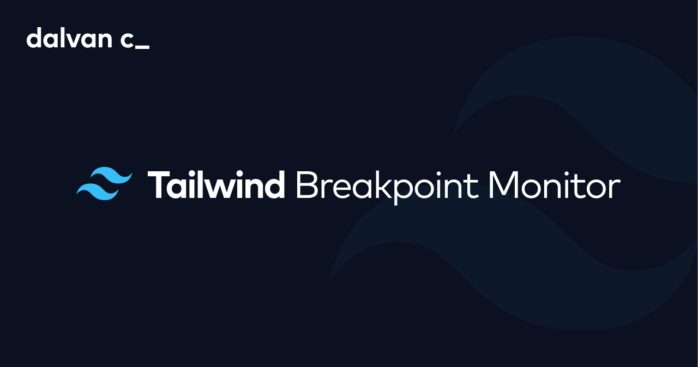

# Tailwind Breakpoint Monitor


**Tailwind Breakpoint Monitor** is a React component that displays the current Tailwind CSS breakpoint in the corner of the screen. It is ideal for developers who want to quickly identify the active breakpoint during development.

<div align="center" style="width: 700px">
  
</div>

## Demo

https://github.com/user-attachments/assets/6816a8aa-8dcd-4843-9424-2057a3a6f7c6

## Installation

```bash
npm install tw-breakpoint-monitor
```

## Usage

```jsx
/* App.jsx */

import { TwBreakpointMonitor } from 'tw-breakpoint-monitor'

export default function App() {
  return (
    <>
      ...
      <TwBreakpointMonitor />
    </>
  )
}
```

<br />

> 💡 **Tip:** Since this component is meant to be used during development, you can also import the `isDevEnvironment` boolean to conditionally render the component only if the app is running in development mode. This way, it will not be rendered on the screen when you preview the production build with `npm run preview`, for example.

```diff
- import { TwBreakpointMonitor } from 'tw-breakpoint-monitor'
+ import { isDevEnvironment, TwBreakpointMonitor } from 'tw-breakpoint-monitor'
```

```jsx
export default function App() {
  return (
    <>
      ...
      {isDevEnvironment && <TwBreakpointMonitor />}
    </>
  )
}
```

## Customization

You can configure the properties below to change the default presentation of the component:

| Property     |                                                                              Description                                                                              | Default        |
| ------------ | :-------------------------------------------------------------------------------------------------------------------------------------------------------------------: | -------------- |
| position     | Place of the screen where the component will be rendered. Available options are `top-left`, `top-center`, `top-right`, `bottom-left`, `bottom-center`, `bottom-right` | `bottom-right` |
| transparency |                                  Determines whether the component will have a level of transparency. Can be either `true` or `false`                                  | `true`         |

<br />

```jsx
// In this example, the component will be rendered in the
// bottom-left part of the screen with full opacity

export default function App() {
  return (
    <>
      ...
      <TwBreakpointMonitor position="bottom-left" transparency={false} />
    </>
  )
}
```

## License

This project is licensed under the **MIT license**. You can read the full license by clicking on the link below:

**[📄 MIT License - Tailwind Breakpoint Monitor](./LICENSE)**

&copy; 2024 **Dalvan Carvalho**
